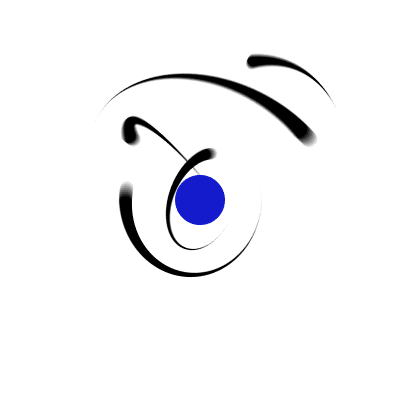

# Guilherme Trevisan

### Software Engineering @ FIAP — Brazil  
### Information Technology Studies @ AIT — Australia

**Software Engineering student building real-world applications and growing toward Full-Stack Engineering.**

`Problem` → `Frontend` → `Backend` → `Database` → `Infrastructure` → `Production`

[English](./README.md) · [Português](./README.pt-BR.md)

 

---

## `> whoami`

I learn by turning real operational problems into software. My current interests include backend development, business automation, APIs, databases, offline-capable applications, testing and infrastructure.

[→ About me](./docs/en/about.md) · [→ My journey](./docs/en/journey.md)

## `> featured_projects`

### Hiperion Protocolos

Internal web application that replaces a paper-based document delivery process with a traceable digital workflow.

`Node.js` `Express` `SQLite` `REST API` `PWA` `Offline Support` `Sync`

[→ Explore Hiperion Protocolos](./docs/en/hiperion-protocolos.md)

### NFSe Hiperion

Automation project designed to reduce repetitive work when downloading and organizing municipal service invoice documents.

[→ Explore NFSe Hiperion](./docs/en/nfse-hiperion.md)

## `> currently_learning`

`React` · `TypeScript` · `SQL` · `Testing` · `Software Architecture` · `Security` · `Cloud & DevOps fundamentals`

[→ What I am studying](./docs/en/learning.md)

## `> international_experience`

🇦🇺 Information Technology studies at **AIT** 
🇦🇺 Advanced English certification from **Australian Pacific College** 

Advanced English and professional communication

---

My goal is to begin my professional career in software development while continuing to grow across the full application lifecycle.

> **Build. Break. Understand. Improve.**
